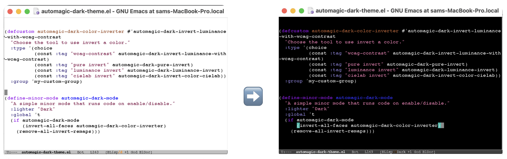

# Automagic Dark Theme

Automatically create a dark (or light mode) for your existing emacs theme.


### Why do I need this?
I use light and dark themes, but it's a pain to maintain. Every time I add custom fonts, I need to make sure I edit it so displays correctly in both modes. This lets you maintain one theme, and get the second automatically.

### How do I use it?
``` M-x automagic-dark-mode ``` to turn it on, and again to turn it off.
#### Installation
Download ```automagic-dark-theme.el``` and put it somewhere in your load path. Then require automagic-dark-mode.

If you downloaded it into "~/.emacs.d/custom/automagic-dark-theme.el", you would do:

```
(add-to-list 'load-path "~/.emacs.d/custom")
(require 'automagic-dark-mode)
```

#### Caveats

- If you set your themes with custom-set-faces, these will take priority over the colors set by automagic, and you'll get weird looking behavior.
- If you switch themes while automagic is on, stuff will break.


## Customizations

### Inversion Mode

The method we use to invert your colors.

Set using ```automagic-dark-color-inverter``` e.g. 

``` (custom-set-variables '(automagic-dark-color-inverter #'automagic-dark-invert-color-cielab)) ```

#### Options
##### WCAG (default)
For every color, invert the luminance, and then readjust the color scheme to maintain roughly the same WCAG contrast ratios. Set using ```automagic-dark-invert-luminance-with-wcag-contrast```.
##### Pure Invert
This inverts the entire color, just like the css invert function. It's good at preserving contrast, but can be confusing if your colors carry semantic meaning (your red for errors will become green for errors). Set using ```automagic-dark-pure-invert```.
##### Luminance Invert
Inverts only the luminance value, i.e. (1 - L), in the HSL color scheme. This works pretty well but fails to maintain consistent contrast.  Set using ```automagic-dark-luminance-invert```.
##### CieLab Invert
This doesn't work that well. I included it because I built it, and I think it's neat, but I'm not sure it's really ready for practical use.  Set using ```automagic-dark-invert-color-cielab```.

### Demo



